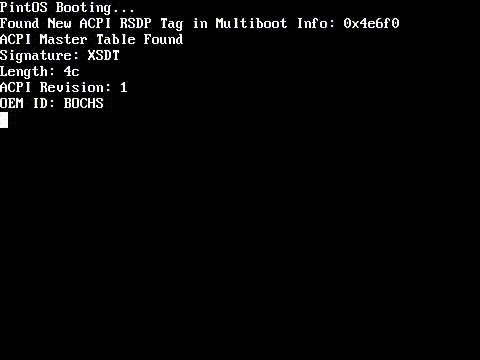
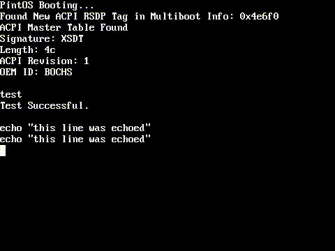

# pintos

A hobbyist operating system for the x86_64 architecture.  
Not intended for real usability, mainly a personal educational project.

## Current Features:

---

### Basic Terminal with Command Parsing

Currently, the terminal runs commands while in the keyboard interrupt
handler. 
Once more of the kernel interfacing is setup, a terminal that runs as a process
is planned. 

---

### Memory Management

The Memory Management is similar in idea to Linux's system, where physical
memory is split up into chunks with a few different sizes, which are then mapped
to a contiguous space in the virtual address space.

The advanced virtual memory systems present in the x86_64 architecture are taken
advantage of, both in the management of the physical memory and by giving each
process its own address-space, with the kernel taking the top half of addresses.

Each processor gets a certain amount of these memory chunks pre-allocated to it,
to reduce bottlenecking with multiple processors requesting memory.

---

### Multithreaded Scheduler

The scheduler is fully multithreading capable, using a priority-based round
robin algorithm, which gives each process a certain slice of time, which is
based on its priority.

Currently, each processor has its own scheduling that takes the next process
from the top of the system ready queue, runs it for a certain amount of time (
based on priority), and returns it to the back of the ready queue.

---

## Planned Features:

- More complete process interface (Signals, etc.)
- Proper process-based Terminal
- File systems and physical storage interfacing
- Libc for user programs
- Porting some of the fundamental programs such as bash
